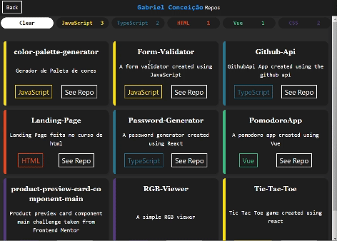

# Github Api App

A Github api made using Vue + Typescript

This project consists of an application that uses the Github's public API to perform queries and display information about users and their repositories. Through this application, users can explore GitHub data efficiently and interactively.

<h1 style="text-align: center;"><a href="https://github-api-sable-nu.vercel.app/"  target="_blank" >See App</a></h1>
## 📷 Images

## 🚀 Functionalities

- **User Query**: It's possible search for information about Github users

- **Repositories Query**: you can see users' repositories and filter by the type of programming language

## 👨‍💻 Technologies

- **Languages**: TypeScript

- **Frameworks**: Vue.js for front-end creating

- **Frameworks CSS**: Tailwind CSS for front-end styling

- **Development Tools**: Visual Studio Code

## 🧐 Linters

## Autor

This project was developed by <a href="https://github.com/gabrielssconceicao" target="_blank">Gabriel Conceição</a>

## 📝 Licença

This project is licensed under the [MIT License](./LICENSE).
